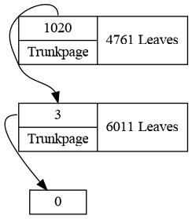

# escalite
SQLite forensic tool

## Usage

```
./escalite.py <database>
```

### Interactive

| cmd           | Description                                  |
|---------------|----------------------------------------------|
| ```help```    | Show available commands                      |
| ```h```       | Show DB header information                   |
| ```p <n>```   | Show information about the n-th page         |
| ```pc <n>```  | Show all cells on page n                     |
| ```pr <n>```  | Try to retrieve deleted data on page n       |
| ```pd <n>```  | Print hexdump of page n                      |
| ```f <n>```   | Show information about freelist trunk page n |
| ```fcl <n>``` | Check if freelist-leaf page n is empty       |
| ```fl```      | Show freelistgraph                           |
| ```exit, q``` | Close program                                |

### Examples graphs

#### Freelist graph: Large empty database



## Features planned

* BTree-graph generation

* Print hexdump of bytes proofing a interpretation of bytes (cmdline-argument)


