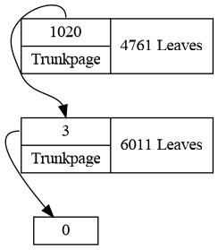
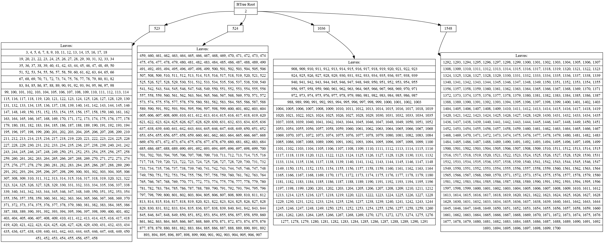

# escalite
SQLite forensic tool, developed to make the analysis of SQLite databases easier. Primarly used for an university course about IT forensic but probably also useful for CTFs and other use cases. No guarantee of completeness or correctness.

All classes are combined in one file to make the program as portable as possible. Python libraries that are not part of the standard python installation are optional (for example graphviz).

## Usage

```
./escalite.py <database>
```

### Interactive

| cmd           | Description                                           |
|---------------|-------------------------------------------------------|
| ```help```    | Show available commands                               |
| ```h```       | Show DB header information                            |
| ```o```       | Show overview of all pages                            |
| ```b <n>```   | Show a graph of the BTree of Page n (Default: n = 2)  |
| ```p <n>```   | Show information about the n-th page                  |
| ```pc <n>```  | Show all cells on page n                              |
| ```pr <n>```  | Try to retrieve deleted data on page n                |
| ```pd <n>```  | Print hexdump of page n                               |
| ```f <n>```   | Show information about freelist trunk page n          |
| ```fcl <n>``` | Check if freelist-leaf page n is empty                |
| ```fl```      | Show freelistgraph                                    |
| ```exit, q``` | Close program                                         |

### Examples graphs

#### Freelist graph: Large empty database


#### BTree graph: Large database (test_fl.db)



## Features planned

* BTree-graph generation *In progress*

	* Interpret first pages to get overview of btree starts

* Print hexdump of bytes proofing a interpretation of bytes (cmdline-argument)


